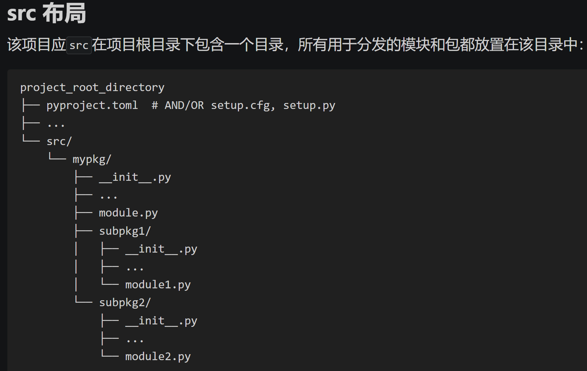
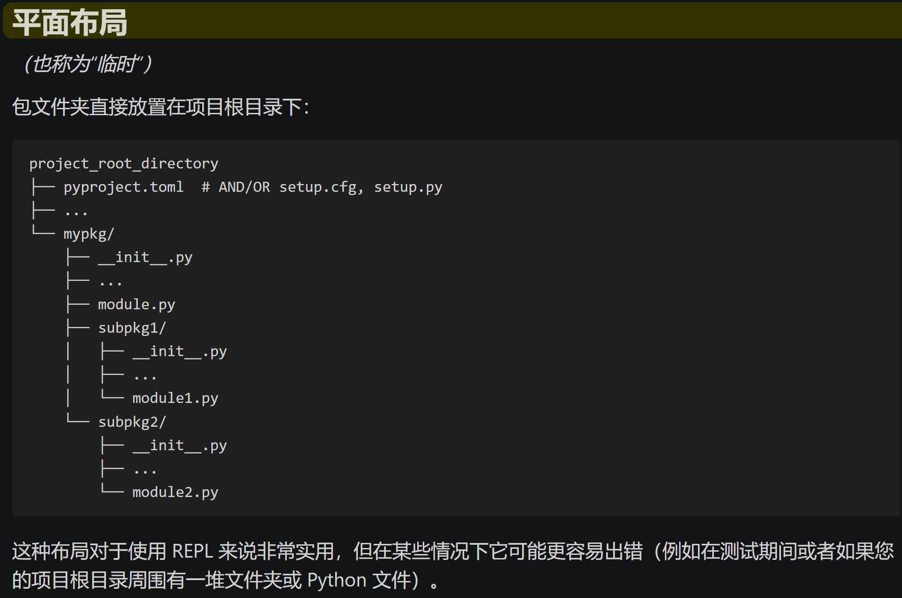
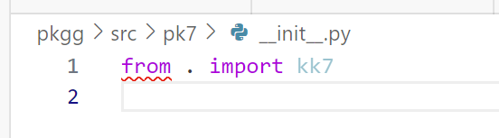
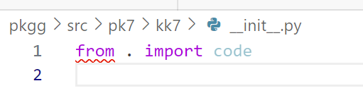

# pkg
implement steps to build packages.

在这几个实验中，发现文件的布局非常重要。
按照官网中 [包发现和命名空间包](https://setuptools.pypa.io/en/latest/userguide/package_discovery.html#finding-namespace-packages)  的描述，选择 src 布局是明智的选择。


mmdetection 用的是 平面布局




## 打包& 安装
```
python -m build
 
pip install ./dist/pk7-0.1-py3-none-any.whl 
```

在具体实验中，pkgg 可以正常 import pkgg
pk5 可以正常 import kk5(!不能导入 pk5)
可以从 pk5.egg-info/top_level.txt 中看到 kk5. 


## __init__.py 中的写法

如果要实现下面这种写法，而不让代码报错 kk7 不是 pk7 的属性
```python
>>> pk7.kk7.code.hello()
hello world!
```
需要在 __init__.py 中分别写入


